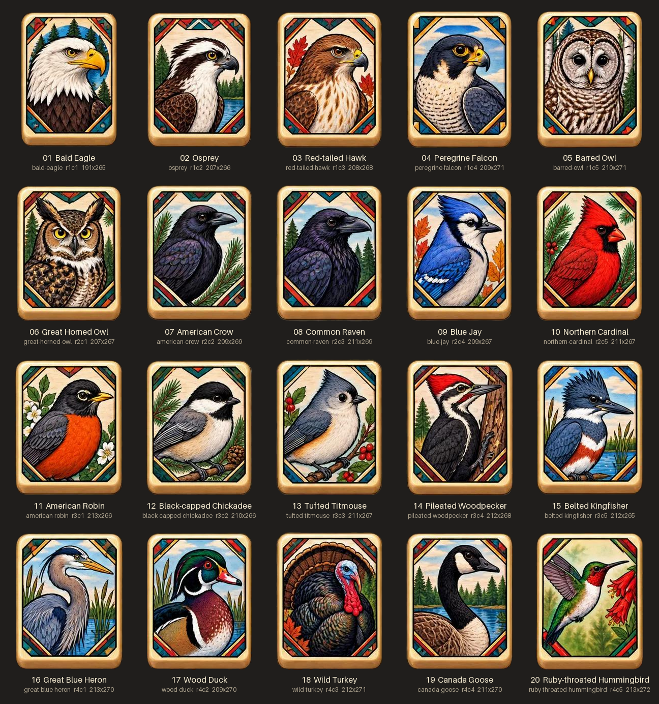

# Bird Mahjong

A small vanilla HTML/CSS/JS project (no build step, no runtime CDN) that
publishes the bird mahjong tiles on GitHub Pages.

`bird-mahjong-tiles.jpg` is the original 5 × 4 tile sheet. It is kept as-is and
is only ever **read** by the tooling; every other image is derived from it.

## Layout

```
bird-mahjong-tiles.jpg     original sheet (source of truth, never modified)
index.html                 tile gallery page
css/style.css
js/main.js                 renders the gallery from data/*.json
data/tiles.json            tile ID ↔ name mapping (hand-maintained)
data/crops.json            measured crop boxes (generated)
assets/tiles/NN-<id>.png   20 individual tiles, RGBA (generated)
assets/contact-sheet.png   labelled overview of all crops (generated)
tools/crop_tiles.py        cropping script
tools/verify_crops.py      crop sanity checks
tools/requirements.txt     Python deps for the tools only
```

All paths in the site are relative, so it works both at a user/org root and
under a project sub-path like `https://<user>.github.io/Bird-Mahjong/`.

## Tile IDs

Tiles are numbered row-major from the top-left of the sheet. File names are
`NN-<id>.png`; the `id` is the stable key used in code.

| #  | ID | Name | # | ID | Name |
|----|----|------|---|----|------|
| 01 | `bald-eagle` | Bald Eagle | 11 | `american-robin` | American Robin |
| 02 | `osprey` | Osprey | 12 | `black-capped-chickadee` | Black-capped Chickadee |
| 03 | `red-tailed-hawk` | Red-tailed Hawk | 13 | `tufted-titmouse` | Tufted Titmouse |
| 04 | `peregrine-falcon` | Peregrine Falcon | 14 | `pileated-woodpecker` | Pileated Woodpecker |
| 05 | `barred-owl` | Barred Owl | 15 | `belted-kingfisher` | Belted Kingfisher |
| 06 | `great-horned-owl` | Great Horned Owl | 16 | `great-blue-heron` | Great Blue Heron |
| 07 | `american-crow` | American Crow | 17 | `wood-duck` | Wood Duck |
| 08 | `common-raven` | Common Raven | 18 | `wild-turkey` | Wild Turkey |
| 09 | `blue-jay` | Blue Jay | 19 | `canada-goose` | Canada Goose |
| 10 | `northern-cardinal` | Northern Cardinal | 20 | `ruby-throated-hummingbird` | Ruby-throated Hummingbird |

**Telling the two dark birds apart** (row 2, columns 2 and 3):

- **07 American Crow** – slimmer, shorter bill; smooth throat; framed by pine
  boughs on both sides, no conifer trees in the background.
- **08 Common Raven** – heavier, deeper, more hooked bill; shaggy throat
  feathers; bulkier body; spruce trees on both sides.

`data/tiles.json` also carries a short `notes` field with visual cues for every
tile, and the contact sheet labels each crop with its number, name and ID.



## Running locally

The page loads `data/*.json` with `fetch`, so serve the folder over HTTP rather
than opening `index.html` from disk:

```sh
python3 -m http.server 8000
# open http://localhost:8000/
```

(Any static server works, e.g. `npx serve`.)

## Regenerating the tile assets

The tiles on the sheet are not on an exact grid — positions drift by several
pixels and sizes vary (roughly 191–213 × 265–272 px). `tools/crop_tiles.py`
therefore measures each tile instead of cutting equal cells:

1. thresholds the sheet (bright tile vs. near-black background),
2. finds the gutters between rows, then between columns within each row,
3. takes the tight bounding box of the tile inside each cell (+2 px padding),
4. flood-fills the background from the crop edges to make the rounded corners
   transparent.

```sh
python3 -m venv .venv && . .venv/bin/activate   # optional
pip install -r tools/requirements.txt
python3 tools/crop_tiles.py     # writes assets/tiles, contact sheet, data/crops.json
python3 tools/verify_crops.py   # exits non-zero if any crop looks wrong
```

Output is deterministic: re-running the script produces byte-identical files.
`verify_crops.py` checks that no tile pixels lie just outside any box (no
clipping), crop edges are background (no neighbour bleed), boxes don't overlap,
corners are transparent and the tile face is fully opaque. To rename a bird,
edit `data/tiles.json` and re-run the script.

## Deploying to GitHub Pages

1. Push to GitHub.
2. Repository **Settings → Pages → Build and deployment**: Source *Deploy from a
   branch*, branch `main`, folder `/ (root)`.
3. The site appears at `https://<user>.github.io/<repo>/`.

A `.nojekyll` file is included so Pages serves the files as-is.
